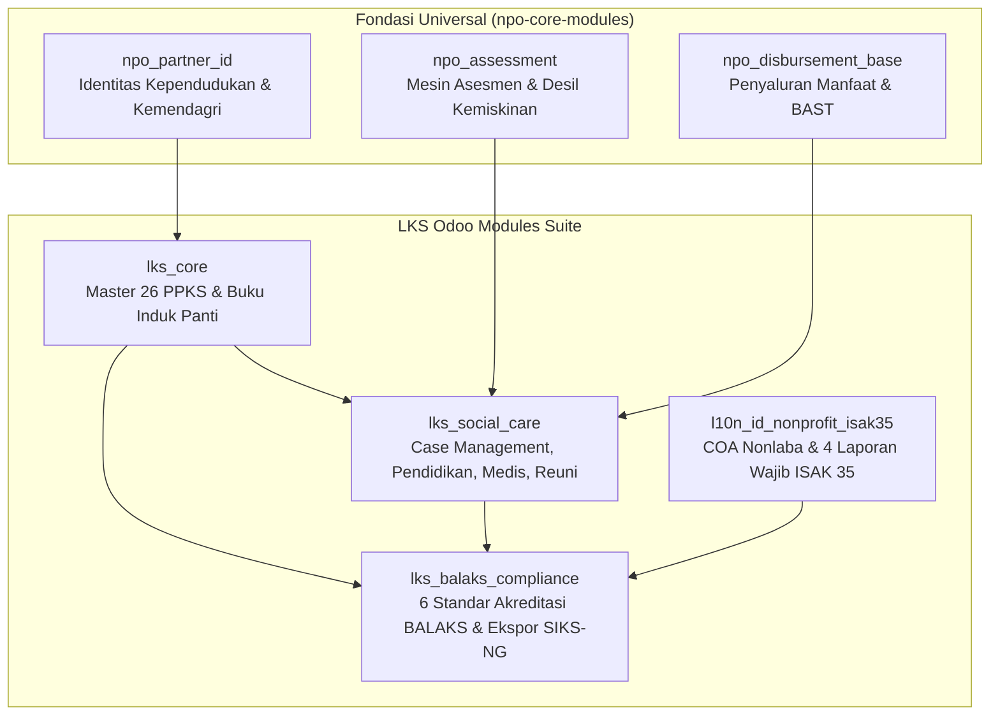

# LKS Odoo Modules (`lks-odoo-modules`)
### Sistem Informasi Manajemen Lembaga Kesejahteraan Sosial (LKS), Panti Asuhan & Organisasi Sosial Indonesia
**Berbasis Odoo 18.0 LTS, 19.0 & 20.0 Community Edition | Standar OCA | Lisensi LGPL-3.0**

[](https://odoo.com)
[](https://kemensos.go.id)
[](LICENSE)

---

## 📋 Tentang Repositori

`lks-odoo-modules` adalah repositori rangkaian modul Odoo open-source kelas enterprise yang dirancang khusus untuk memenuhi kebutuhan tata kelola operasional, asuhan sosial, akuntansi, dan kepatuhan akreditasi bagi:
1. **Lembaga Kesejahteraan Sosial (LKS)**
2. **Panti Asuhan Anak / Lembaga Pengasuhan Kesejahteraan Sosial Anak (LPKSA)**
3. **Panti Wreda / Griya Lansia / LKS Lanjut Usia**
4. **Panti Rehabilitasi Sosial Penyandang Disabilitas**
5. **Rumah Singgah, Shelter Sosial, dan Organisasi Nirlaba/Filantropi Sosial**

Sistem ini bersifat **inklusif (lintas agama dan lintas sektoral)** serta dirancang patuh penuh pada regulasi nasional:
1. **UU No. 11 Tahun 2009** tentang Kesejahteraan Sosial.
2. **Permensos RI No. 184/HUK/2011** tentang Lembaga Kesejahteraan Sosial & **Permensos No. 08 Tahun 2012** tentang Pedoman Pendataan PPKS.
3. **Standar Akreditasi Nasional BALAKS** (Badan Akreditasi Lembaga Kesejahteraan Sosial Kemensos RI).
4. **ISAK 35 (DSAK IAI)** tentang Penyajian Laporan Keuangan Entitas Berorientasi Nonlaba (menggantikan PSAK 45).
5. **Interoperabilitas SIKS-NG Kemensos** (Sistem Informasi Kesejahteraan Sosial Next Generation).

---

## 🏛️ Arsitektur Modul



---

## 📦 Struktur & Modul dalam Repositori

| Modul | Nama Teknis | Dependensi | Ringkasan Fungsi Utama |
|---|---|---|---|
| **1. LKS Core** | `lks_core` | `base`, `mail`, `npo_partner_id` | Master 26 Kategori PPKS Kemensos, Buku Induk Klien, Status Residensial (Dalam/Luar Panti), Manajemen Asrama & Kamar, Petugas Pendamping (Peksos). |
| **2. Social Care** | `lks_social_care` | `lks_core`, `npo_assessment`, `npo_disbursement_base` | Case Management, Monitoring Pendidikan & Rapor Semester, Rekam Medis & Imunisasi Panti, Rencana Intervensi (Case Plan), Terminasi & Reuni Keluarga. |
| **3. Akuntansi ISAK 35** | `l10n_id_nonprofit_isak35` | `account`, `base`, `mail` | Bagan Akun Standar (COA) Yayasan/LKS, Pembatasan Aset Neto (Unrestricted vs Restricted), Wizard & Engine 4 Laporan Keuangan Wajib ISAK 35. |
| **4. Kepatuhan BALAKS** | `lks_balaks_compliance` | `lks_core`, `lks_social_care`, `l10n_id_nonprofit_isak35` | Kesiapan 6 Standar Nasional BALAKS Kemensos, Simulasi Audit & Skoring Otomatis, Profil Legalitas LKS, Ekspor Data Binaan Format SIKS-NG Kemensos. |

---

## 🏷️ 26 Kategori PPKS Resmi Kemensos RI (lks_core)

Modul `lks_core` telah memuat data awal resmi 26 kategori Pemerlu Pelayanan Kesejahteraan Sosial (PPKS):

| No | Kode | Nama Kategori PPKS | Kluster | Sasaran Usia | Standar Pelayanan Minimal (SPM) |
|---|---|---|---|---|---|
| 1 | `ABT` | Anak Balita Telantar | Anak | Balita (0-4) | Pemenuhan ASI/Susu, Gizi Balita, Asuhan Pengganti |
| 2 | `AT` | Anak Telantar | Anak | Anak (5-17) | Asuhan Pengganti Panti, Bantuan Pendidikan (KIP/PIP), Budi Pekerti |
| 3 | `ABH` | Anak Berhadapan dengan Hukum | Anak | Anak (5-17) | Advokasi Hukum, Pendampingan Sakti Peksos, Diversi/LPKS |
| 4 | `AJ` | Anak Jalanan | Anak | Anak (5-17) | Rumah Singgah, Pendekatan Outreach, Kejar Paket, Vokasional |
| 5 | `ADK` | Anak dengan Kedisabilitasan | Anak | Anak (5-17) | Pendidikan Inklusif/SLB, Alat Bantu, Terapi Wicara/Fisik |
| 6 | `AKTK` | Anak Korban Tindak Kekerasan | Anak | Anak (5-17) | Trauma Healing, Safe House / Rumah Aman, Reintegrasi |
| 7 | `AMPK` | Anak Memerlukan Perlindungan Khusus | Anak | Anak (5-17) | Perlindungan Hukum, Layanan Medis Khusus, Asuhan Berizin |
| 8 | `LUT` | Lanjut Usia Telantar | Lansia | Lansia (>=60) | Permakanan 3x Sehari, Griya Lansia/Day Care, Perawatan Geriatri |
| 9 | `DIS-FISIK` | Penyandang Disabilitas Fisik | Disabilitas | Semua Usia | Fisioterapi, Kaki/Tangan Palsu, Kursi Roda, Aksesibilitas |
| 10 | `DIS-NETRA` | Disabilitas Sensorik Netra | Disabilitas | Semua Usia | Orientasi Mobilitas (Tongkat Putih), Braille, Screen Reader |
| 11 | `DIS-RUNGI` | Disabilitas Sensorik Rungu Wicara | Disabilitas | Semua Usia | Alat Bantu Dengar (ABD), Terapi Wicara, Bahasa Isyarat (BISINDO) |
| 12 | `DIS-GRAHITA` | Disabilitas Intelektual | Disabilitas | Semua Usia | Bina Diri (ADL), Terapi Okupasi, Pembiasaan Mandiri |
| 13 | `DIS-MENTAL` | Disabilitas Mental / Eks-Psikotik | Disabilitas | Dewasa | Bebas Pasung, Pendampingan Psikiater, Resosialisasi Komunitas |
| 14 | `DIS-GANDA` | Disabilitas Ganda / Multipel | Disabilitas | Semua Usia | Total Care, Asuhan Khusus, Perawatan Penuh Residensial |
| 15 | `GELANDANG` | Tuna Sosial / Gelandangan | Tuna Sosial | Dewasa | Shelter Sementara, Pembuatan NIK/KTP, Pelatihan Kerja |
| 16 | `PENGEMIS` | Pengemis | Tuna Sosial | Semua Usia | Pembinaan Kemandirian, Bantuan Modal Usaha, Pemulangan Asal |
| 17 | `PEMULUNG` | Pemulung | Tuna Sosial | Semua Usia | Bantuan Sarana Usaha (Gerobak), Sanitasi, Pendidikan Anak |
| 18 | `MINORITAS` | Kelompok Minoritas Sosial | Tuna Sosial | Dewasa | Advokasi Hak Sipil (KTP/KK), Penerimaan Sosial, Wirausaha |
| 19 | `BWBP` | Bekas Warga Binaan Pemasyarakatan | Tuna Sosial | Dewasa | Resosialisasi, Pelatihan Vokasional, Bantuan Modal Awal |
| 20 | `ODHA` | Orang dengan HIV/AIDS | Tuna Sosial | Semua Usia | Pengobatan ARV Rutin, Nutrisi Tambahan, Perlindungan Anti-Stigma |
| 21 | `NAPZA` | Korban Penyalahgunaan NAPZA | Tuna Sosial | Semua Usia | Rehabilitasi Therapeutic Community (TC), Detoksifikasi Medis |
| 22 | `TPPO` | Korban Perdagangan Orang | Korban | Semua Usia | Rumah Perlindungan Trauma Center (RPTC), Pemulangan, Reintegrasi |
| 23 | `KTK` | Korban Tindak Kekerasan | Korban | Semua Usia | Shelter Darurat, Layanan Visum & Medis, Bantuan Hukum |
| 24 | `PMBS` | Pekerja Migran Bermasalah Sosial | Korban | Dewasa | Layanan Transit RPTC, Pemulangan Kampung Halaman, Pemberdayaan |
| 25 | `BENC-ALAM` | Korban Bencana Alam | Korban | Semua Usia | Dapur Umum, Hunian Sementara, Logistik Darurat, Dukungan Psikososial |
| 26 | `BENC-SOSIAL` | Korban Bencana Sosial / Pengungsi | Korban | Semua Usia | Shelter Pengungsi, Mediasi Perdamaian, Bantuan Permakanan |
| 27 | `KBSP` | Fakir Miskin / Keluarga Rentan | Keluarga | Semua Usia | Bantuan ATENSI Kemensos, Bantuan Usaha Ekonomi Produktif (UEP) |

---

## 💼 Akuntansi Nonlaba Standar ISAK 35 (`l10n_id_nonprofit_isak35`)

Modul akuntansi ini menyajikan 4 Laporan Keuangan Wajib Entitas Nonlaba sesuai ketentuan DSAK IAI:
1. **Laporan Posisi Keuangan**:
   - Pemisahan Kas & Setara Kas Tanpa Pembatasan vs Dengan Pembatasan.
   - Aset Lancar, Aset Tetap Neto.
   - Liabilitas Jangka Pendek & Jangka Panjang.
   - Aset Neto Tanpa Pembatasan (*Unrestricted Net Assets*).
   - Aset Neto Dengan Pembatasan (*Restricted Net Assets* - Hibah Program Kemensos/APBD/Donor CSR).
2. **Laporan Penghasilan Komprehensif (Laporan Aktivitas)**:
   - Pendapatan Tanpa Pembatasan (Sumbangan Masyarakat, Infaq, Jasa Layanan Mandiri).
   - Pendapatan Dengan Pembatasan (Bantuan Pemerintah APBN/APBD, Hibah Lembaga).
   - Reklasifikasi Aset Neto yang Terbebaskan dari Pembatasan (*Released Net Assets*).
   - Beban Program Pelayanan Sosial (Permakanan, Pendidikan, Kesehatan, Bimbingan Mental, Bantuan Keluarga).
   - Beban Pendukung (Manajemen Kantor, Administrasi Umum, dan Fundraising).
3. **Laporan Perubahan Aset Neto**:
   - Rekonsiliasi Saldo Awal Aset Neto, Surplus/Defisit Berjalan, dan Saldo Akhir.
4. **Laporan Arus Kas**:
   - Arus kas dari Aktivitas Operasi, Aktivitas Investasi, dan Aktivitas Pendanaan.

---

## 🏆 Kepatuhan Akreditasi BALAKS Kemensos (`lks_balaks_compliance`)

Modul ini menyiapkan LKS agar sukses menghadapi audit akreditasi resmi Kemensos dengan fitur:
* **Matriks 6 Standar Nasional BALAKS**:
  - Standar Program (15%)
  - Standar Proses Pelayanan (20%)
  - Standar Manajemen Organisasi (15%)
  - Standar SDM & Peksos (20%)
  - Standar Sarana dan Prasarana (15%)
  - Standar Hasil Layanan (15%)
* **Prediksi Peringkat Akreditasi**:
  - Skor >= 86.00: **Akreditasi A (Sangat Baik / Unggul)**
  - Skor 71.00 - 85.99: **Akreditasi B (Baik)**
  - Skor 56.00 - 70.99: **Akreditasi C (Cukup)**
  - Skor < 56.00: **Tidak Terakreditasi**
* **Ekspor Data Binaan Format SIKS-NG Kemensos**:
  - Wizard pengekspor data PPKS ke format CSV (34 kolom standar SIKS-NG) siap impor ke sistem pusat Kemensos dan Dinas Sosial.

---

## 📄 Laporan Cetak Resmi QWeb PDF

Sistem dilengkapi dengan template dokumen resmi:
1. **Kartu Identitas Klien PPKS** (ID Card klien dengan foto, biodata, dan kamar asrama).
2. **Lembar Buku Induk Registrasi Klien Kemensos** (Format resmi pencatatan buku induk panti).
3. **Berita Acara Serah Terima Penerimaan Klien (BAST Masuk)**.
4. **Rapor Catatan Perkembangan Layanan Klien (Case Plan)**.
5. **Resume Rekam Medis & Riwayat Kesehatan Klien Panti**.
6. **Berita Acara Reuni & Penyatuan Kembali ke Keluarga (Sakti Peksos)**.
7. **Buku 4 Laporan Keuangan Wajib Standar ISAK 35**.
8. **Lembar Evaluasi Kesiapan Akreditasi 6 Standar BALAKS Kemensos**.
9. **Laporan Profil Kelembagaan LKS untuk Dinas Sosial**.

---

## 🚀 Panduan Instalasi & Deploy

### 1. Salin Modul ke Direktori Addons Odoo
```bash
# Pastikan dependensi npo-core-modules sudah tersedia
git clone git@github.com:npo-core-modules/npo-core-modules.git
git clone git@github.com:lks-odoo-modules/lks-odoo-modules.git

# Buat symlink ke direktori extra-addons Odoo
ln -s /path/to/lks-odoo-modules/* /path/to/odoo/extra-addons/
```

### 2. Update Apps List & Instalasi
1. Masuk ke Odoo sebagai **Administrator**.
2. Aktifkan **Developer Mode** (`/web#action=...&debug=1`).
3. Buka menu **Apps > Update Apps List**.
4. Cari dan instal modul secara berurutan:
   - `lks_core`
   - `lks_social_care`
   - `l10n_id_nonprofit_isak35`
   - `lks_balaks_compliance`

---

## ⚖️ Lisensi & Hak Cipta
Modul ini dilisensikan di bawah **GNU Lesser General Public License v3.0 (LGPL-3.0)**.  
Dikembangkan untuk memajukan tata kelola kesejahteraan sosial Indonesia yang inklusif, akuntabel, dan transparan.
